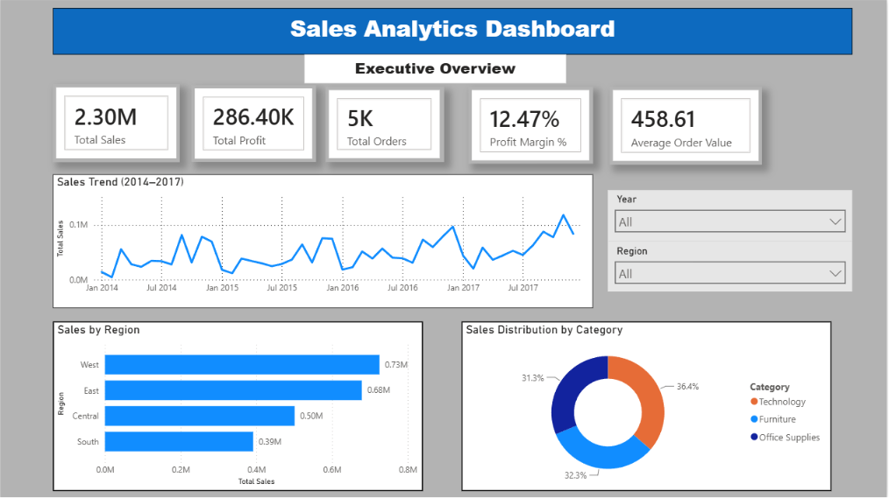
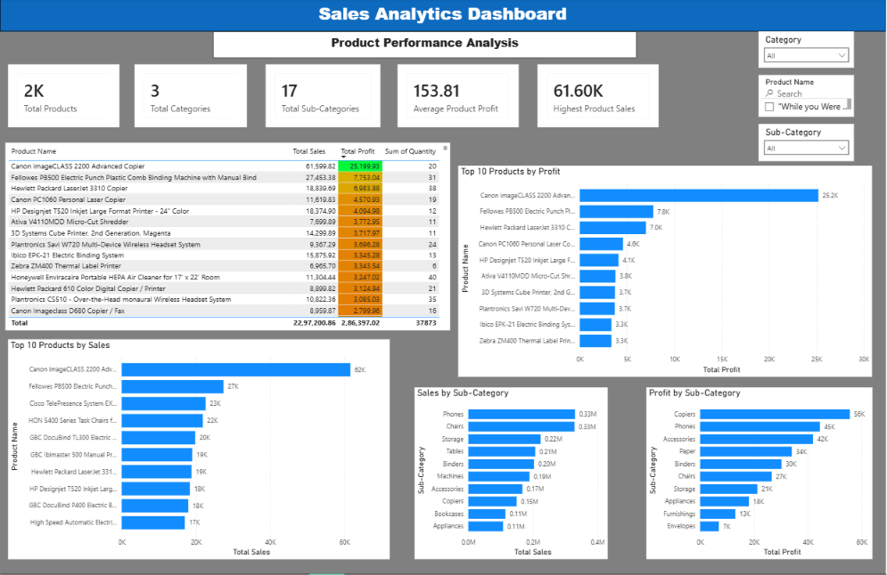
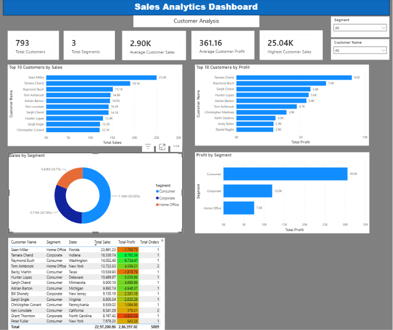
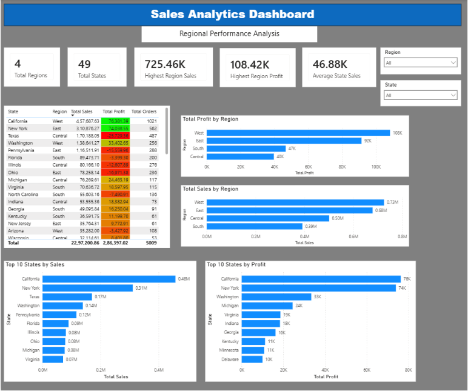

# 📊 Power BI Sales Analytics Dashboard

## Project Overview

This project demonstrates an end-to-end Business Intelligence workflow using Microsoft Power BI and the Sample Superstore dataset.

The objective was to transform raw retail transaction data into meaningful business insights through data cleaning, data modeling, DAX calculations, and interactive dashboard development.

The final solution consists of four dashboard pages that provide comprehensive analysis of sales performance, product performance, customer behavior, and regional trends.

---

## Business Objectives

This project was designed to answer the following business questions:

- What is the overall sales performance of the business?
- Which regions generate the highest sales and profit?
- Which products contribute the most revenue?
- Which products generate the highest profit?
- Which customers contribute the most sales?
- Which customer segments are most valuable?
- Which states perform best in terms of sales and profitability?
- How has business performance changed over time?

---

## Dashboard Pages

### 1. Executive Overview

Provides a high-level summary of business performance.

**KPIs:**
- Total Sales
- Total Profit
- Total Orders
- Profit Margin %
- Average Order Value

**Visuals:**
- Sales Trend Analysis
- Sales by Region
- Sales Distribution by Category
- Interactive Filters

---

### 2. Product Performance Analysis

Provides detailed analysis of products and sub-categories.

**KPIs:**
- Total Products
- Total Categories
- Total Sub-Categories
- Average Product Profit
- Highest Product Sales

**Visuals:**
- Top 10 Products by Sales
- Top 10 Products by Profit
- Sales by Sub-Category
- Profit by Sub-Category
- Product Performance Table

---

### 3. Customer Analysis

Analyzes customer purchasing behavior and profitability.

**KPIs:**
- Total Customers
- Total Segments
- Average Customer Sales
- Average Customer Profit
- Highest Customer Sales

**Visuals:**
- Top Customers by Sales
- Top Customers by Profit
- Sales by Segment
- Profit by Segment
- Customer Performance Table

---

### 4. Regional Performance Analysis

Provides geographic analysis of sales and profitability.

**KPIs:**
- Total Regions
- Total States
- Highest Region Sales
- Highest Region Profit
- Average State Sales

**Visuals:**
- Sales by Region
- Profit by Region
- Top States by Sales
- Top States by Profit
- Regional Performance Table

---

## Dashboard Screenshots

### Executive Overview



### Product Performance Analysis



### Customer Analysis



### Regional Performance Analysis



---

## Key Insights

- Total Sales exceeded **$2.29 Million**
- Total Profit exceeded **$286 Thousand**
- Profit Margin reached approximately **12.47%**
- West Region generated the highest sales performance
- California emerged as the highest-performing state
- Technology category contributed the highest sales revenue
- Consumer segment generated the highest sales and profit
- Sales demonstrated an increasing trend over time
- Several products and customers were identified as major contributors to revenue and profitability

---

## Data Analytics Workflow

1. Data Collection
2. Data Cleaning using Power Query
3. Data Validation
4. Data Modeling (Star Schema)
5. DAX Measure Development
6. Dashboard Design
7. Business Insight Generation
8. Documentation using LaTeX
9. GitHub Publication

---

## Tools & Technologies Used

- Microsoft Power BI Desktop
- Power Query
- DAX (Data Analysis Expressions)
- Data Modeling
- Microsoft Excel
- LaTeX (Overleaf)
- GitHub

---

## Skills Demonstrated

### Data Preparation
- Data Cleaning
- Data Validation
- Data Profiling
- Power Query

### Data Modeling
- Star Schema Design
- Relationship Management
- Date Table Creation

### DAX Development
- KPI Development
- Business Calculations
- Analytical Measures

### Dashboard Design
- Interactive Dashboards
- KPI Cards
- Data Visualization
- Dashboard Navigation
- Conditional Formatting

### Business Analytics
- Sales Analysis
- Product Analysis
- Customer Analysis
- Regional Analysis
- Data Storytelling

---

## Project Files

```text
Sales-Analytics-Dashboard.pbix
Sample-Superstore.csv
ExecutiveOverview.png
Executive_Overview.pdf
README.md
```

---

## Project Report

Complete project documentation is included in the repository.

The report contains:

- Project Overview
- Business Objectives
- Data Cleaning Process
- Data Modeling
- DAX Measures
- Dashboard Development
- Key Insights
- Business Recommendations
- Future Enhancements

---

## Future Enhancements

- Power BI Service Deployment
- Drill-Through Reports
- Row-Level Security (RLS)
- Forecasting and Trend Analysis
- Mobile Dashboard Layout
- Real-Time Data Integration
- Advanced Customer Segmentation

---

## Repository

GitHub Repository:

https://github.com/1998sumitkumar67-arch/PowerBI-sales-analytics-dashboard

---

## Author

**Sumit Kumar**

Aspiring Data Analyst | Power BI Enthusiast | Business Intelligence Learner

---

⭐ If you found this project useful, consider giving the repository a star.
